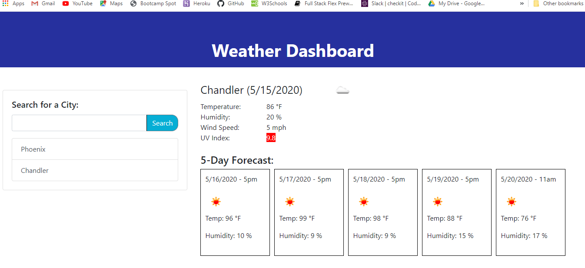

# Weather-Dashboard

## Methodology

The current WeatherCities history, in JSON format, is retrieved from local storage. This history is created from the cities previously searched for. The weather for the most recent city in the history array (the last one in the list) will be displayed when the page is first loaded. If there is no city history data then an empty page will be displayed.

If a city name is input in the search area  and the search button clicked the program makes three AJAX calls to the weather API:
  - the first for the current weather conditions
  - the second to get the UV Index using the city's latitude and longitude returned by the 1st call
  - the third to get 5-day forecast data 

After the weather data has been displayed for a city, the city's name and id number will be saved in the history array (if it doesn't already exist in the array) and the updated history array is stored, in JSON format, in local storage.

Using a city name of "clear" in the search field will delete the city history array, allowing for a fresh start.

## Technology used
Bootstrap, jQuery, Momemt.js, dotenv and AJAX & Axios for API calls to 'openweathermap.org'

## GitHub Code
https://github.com/JimGreasley/Weather-Dashboard

## Heroku deployment
https://rhubarb-crumble-97219.herokuapp.com/

## Screen image:

